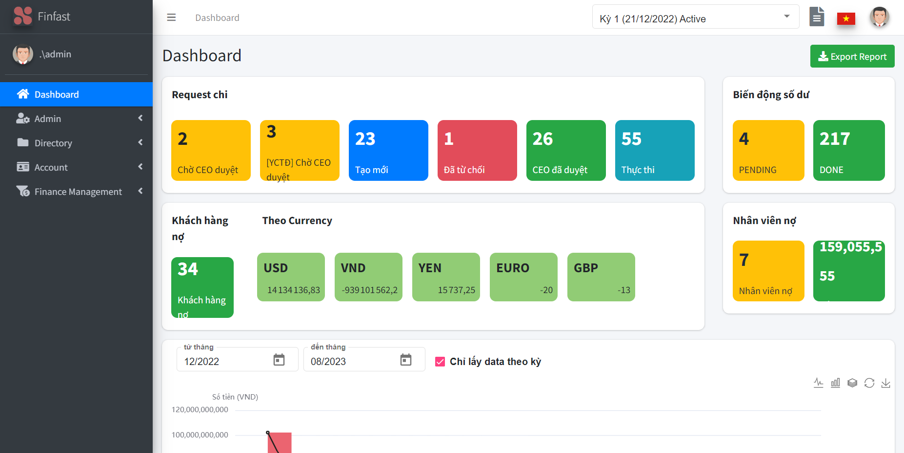
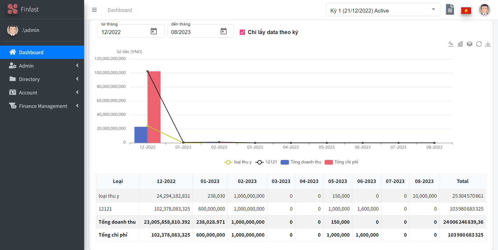
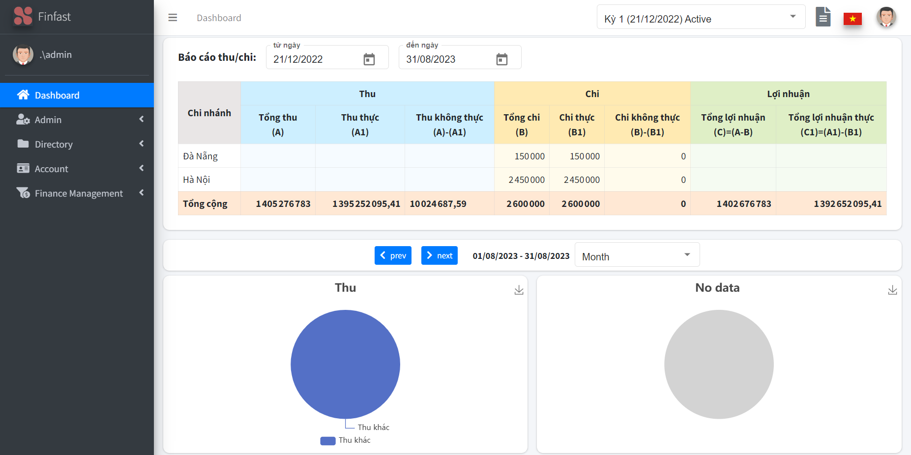
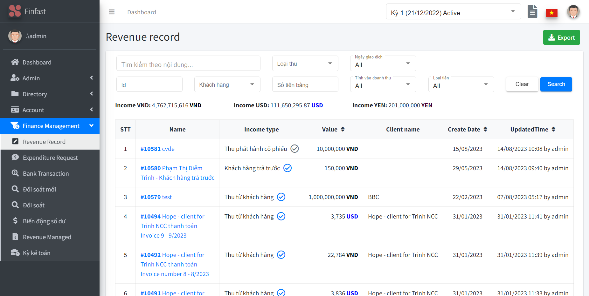
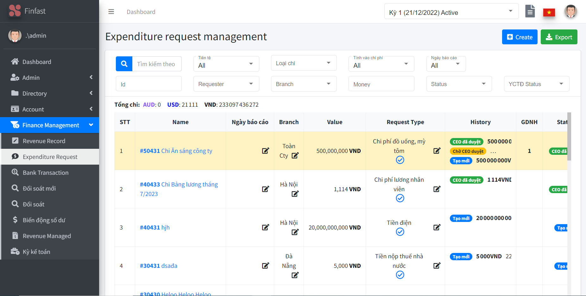
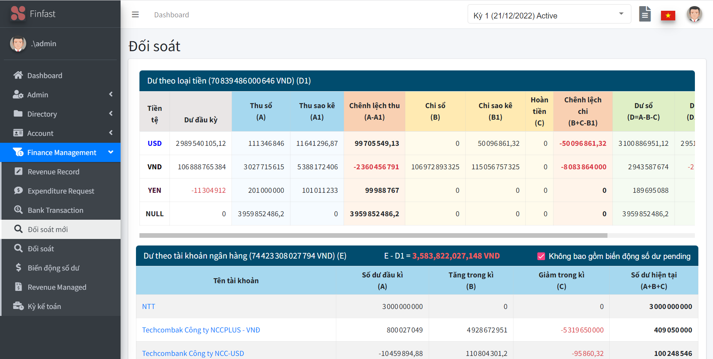
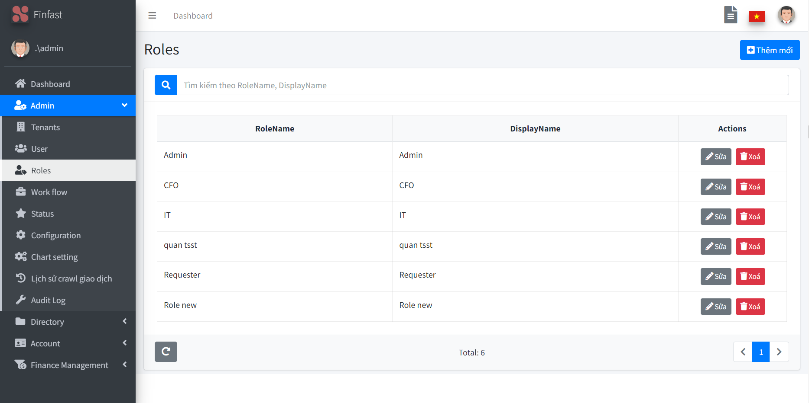
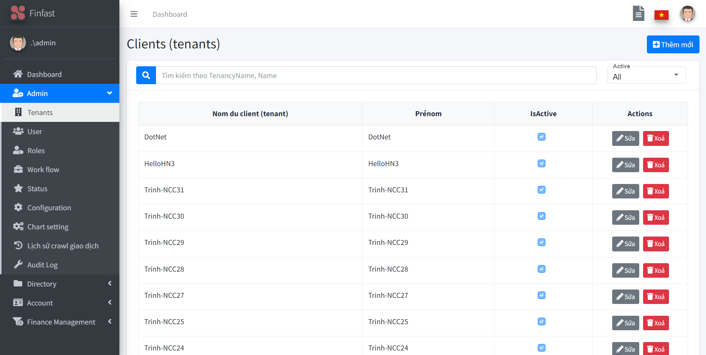

# FinanceManagement
## Overview
Finance Management (Finfast) is the optimal financial management solution for businesses. Finfast is a place to help store and digitize invoices and documents of businesses, making management easier and more systematic.

## Table of Contents
- [Getting Started](#getting-started)
  - [Prerequisites](#prerequisites)
  - [Backend Setup](#backend-setup)
  - [Frontend Setup](#frontend-setup)
  - [Running](#running)
- [Screenshots](#screenshots)
- [License](#license)

## Getting Started

### Prerequisites
Before you begin, ensure you have met the following requirements:
- [Visual Studio 2022](https://visualstudio.microsoft.com/fr/downloads/) installed
- [Visual Studio code](https://code.visualstudio.com/) installed
- [SQL Server 2022](https://www.microsoft.com/en-us/sql-server/sql-server-downloads) installed
- [SQL Server Management Studio (SSMS)](https://learn.microsoft.com/en-us/sql/ssms/download-sql-server-management-studio-ssms?view=sql-server-ver16) installed
- [Node 14.17.0](https://nodejs.org/en/blog/release/v14.17.0) installed
- [.NET Core 3.1 SDK](https://dotnet.microsoft.com/en-us/download/dotnet/3.1) installed
- [Git](https://www.git-scm.com/downloads) installed
### BackEnd Setup
1. **Create a folder** to store project code
- Ex: **ncc-erp-finance** folder
2. **Clone project** in this created folder, `Right Click` and select `Git Bash Here` to use the following command: 
```bash
git clone https://github.com/ncc-erp/ncc-erp-finance.git
```
3. Open the **Finance Management Solution** using **Visual Studio 2022**:

- Launch **Visual Studio 2022**.
- Select `File` > `Open` > `Project/Solution.`
- Navigate to the **aspnet core** folder within created folder **ncc-erp-finance** and open the **FinanceManagement.sln** file.

4. Set the Startup Project:
- At **Solution Explorer** (or you can open it by using `ctrl+alt+L`), open **src** folder
- `Right Click` on **FinanceManagement.Web.Host**  and choose `Set as Startup Project`

5. Create a local Database
- Launch **SQL Server Management Studio (SSMS)** and connect to your Local Database
- `Right Click` on **Database** folder and choose `New Database` with database name such as: *FinanceManagementDB*

6. Update some Setting files
- Navigate to **FinanceManagement.Web.Host** > **appsettings.json** and config the **ConnectionStrings** (with Server name, User ID, Password created when you install SQL Server) like this:
```bash
"ConnectionStrings": {
    "Default": "Server=.\\SQLEXPRESS;Database=FinanceManagementDB;TrustServerCertificate=True;User ID=sa;Password=123456;MultipleActiveResultSets=true;"
  }
```
You also have to set other paramaters here when you need.
- **FinanceManagement.Web.Host** > **appsettings.json** > **appsettings.Staging.json**
```bash
"ConnectionStrings": {
    "Default": "Server=.\\SQLEXPRESS; Database=FinanceManagementDb; User=sa; Password=123456;"
  }
```
-  Navigate to **FinanceManagement.Migrator** > **appsettings.json** and also config this file:
```bash
"ConnectionStrings": {
    "Default": "Server=localhost; Database=FinanceManagementDb; Trusted_Connection=True;"
  }
```

7. Update Database
- Open **Tool** > **NuGet Package Manager** > **Package Manager Console**
- At **Default project** choose **src\FinanceManagement.EntityFrameworkCore**
- Then use this command and wait some minutes:
```bash
update-database
```

8. Run the project
Choose **Debug** > **Start Debuging** (`F5`) or **Start without Debuging** (`ctrl+F5`) to run the backend project.

### FrontEnd Setup
1. Open **Angular** folder using **Visual Studio Code**
- Launch **Visual Studio Code**
- **File** > **Open folder...** (`ctrl+K+O`)
- Choose the **Angular** folder within created folder **ncc-erp-finance**

2. Install frontend dependencies
- Select **Terminal** > **New Terminal**
- Using this command:
```bash
npm install
```
- Then 
```bash
npm audit fix
```

3. Install Angular CLI 9.1.4 globally
```bash
npm install -g @angular/cli@9.1.4
```

4. Run the frontend project
```bash
npm start
```

5. Login
- Login with the default account:
```bash
Username: admin
Password: 123qwe
```

### Running
To run the project, use these commands:

1. Start the backend using `Visual Studio Code` or the `command line`.

2. Start the frontend:

```bash
npm start
```

## Screenshots
FinanceManagement tool has varios function for you to manage your company's finance, such as:
- Dashboard 



- Revenue Record

- Expenditure Request

- For Control

- Roles

- Ternants


## License
[MIT License](./LICENSE)
